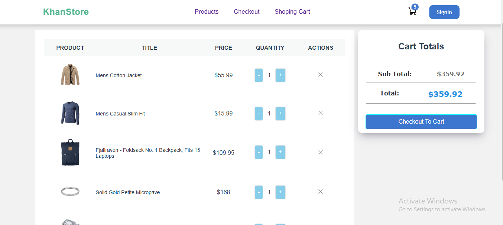
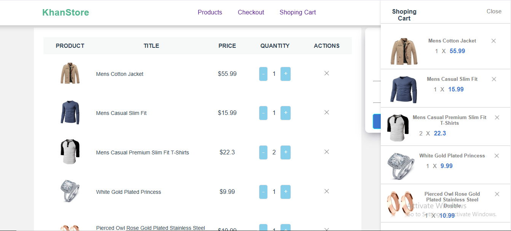
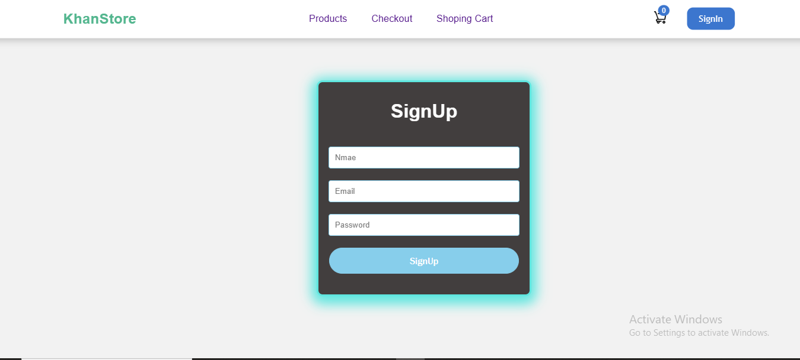
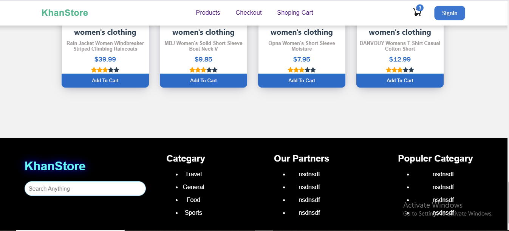

# Vue eCommerce Store

## Overview
A responsive eCommerce store built with Vue.js and CSS. The project showcases an interactive shopping experience with features like product listing, cart management, and dynamic updates. update

## Features
- Dynamic product listing with Vue.js.
- Interactive cart management.
- Fully responsive design with CSS.
- Currency formatting and styled cart content.

## Tech Stack
- Vue.js
- CSS

## Project Images






## Getting Started
1. Clone the repository:
   ```bash
   git clone https://github.com/umarwazeer/Vue-eCommerce-Store.git
